# KuroDLC Modding Toolkit

A comprehensive Python toolkit for creating and managing DLC mods for games using the KuroDLC format. This toolkit provides utilities for item discovery, ID management, conflict resolution, shop assignment automation, **schema conversion from KuroTools**, **ID allocation visualization**, **automatic MDL-to-DLC entry generation**, and **3D model viewing with textures, animations, and scene rendering**.

[](https://www.python.org/downloads/)
[](LICENSE)

---

## 3D Model Viewer — Changelog

**viewer_mdl_textured_anim.py/exe** — full-featured 3D model viewer with textures, skeleton, animations, physics, controller support, scene mode, and more.

Ideally associate the .exe with .mdl files. For correct display of textures it looks for the standard folder structure. For proper function it needs to have all necessary data extracted in the game data structure, including `model_info` and `.mdl` with animations.

```
└───asset
    ├───common
    │   └───model
    │   └───model_info
    └───dx11
        └───image
        └───shader
```

### Ver 1.0 — viewer_mdl_textured_anim.py/exe
skybox support, changing lighting and background colors
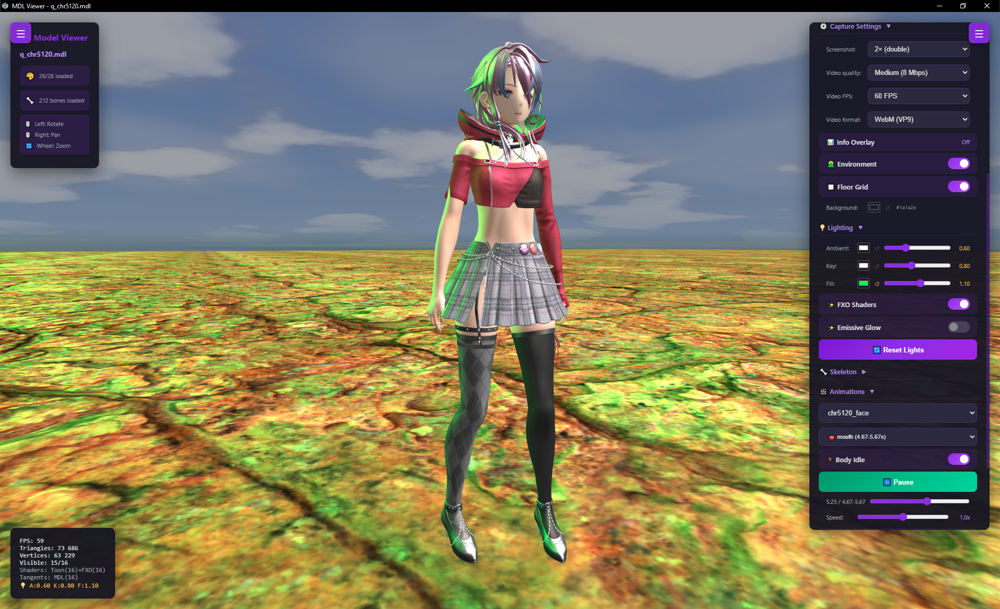

## New Features in Beta

- **Bug fixes**
- **Added controller support**
- **Binary format support** – loading files from `model_info` with autodetection
- **UI overhaul** – complete redesign of the entire interface
- **Video recording** – including quality settings for video and screenshots
- **Physics improvements**
  - Still has known bugs
  - Physics now reacts to character movements with the mouse (requires physics display enabled in UI)
- **fixed bug in controller autodetection**
- **added support for additional controllers, DualSense, DualShock, Switch Pro, Generic**
- **support for keyboard control if controller is not detected (WSAD)**
- **improved controller visualization in overlay**
- **3D FreeCam mode for viewing models such as landscapes, buildings, etc.**
- **support for game shader files (FXO), fallback to original shaders if not available or force fallback with --no-shaders**
- **adding a focus function in the UI on the overall model and within individual meshes, for large models such as landscapes, etc.**
- **mesh highlighting, meshes with box, shadow, kage in the name are hidden by default**
- **support for lighting settings, enabling and disabling FXO shaders on the fly**
- **emissive_g fix**
- **facial animations**
- **change exe file icon **
- **skybox support, changing lighting and background colors**
---

### Beta9
added facial animations
change exe file icon  (`-m PyInstaller --onefile --icon=app.ico`)

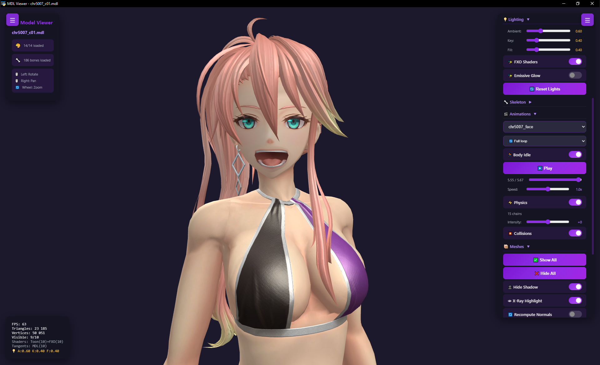

### Beta8
mesh highlighting, meshes with box, shadow, kage in the name are hidden by default
support for lighting settings, enabling and disabling FXO shaders on the fly
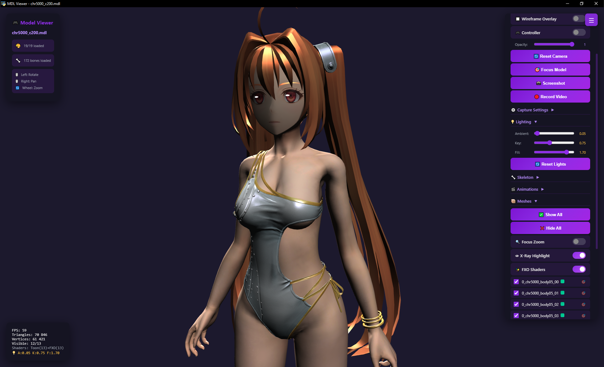


### Beta7
support for game shader files (FXO), fallback to original shaders if not available or force fallback with `--no-shaders`
```
└───asset
    ├───common
    │   └───model
    │   └───model_info
    └───dx11
        └───image
        └───shader
```
Game FXO shaders


Generated shaders — no FXO files

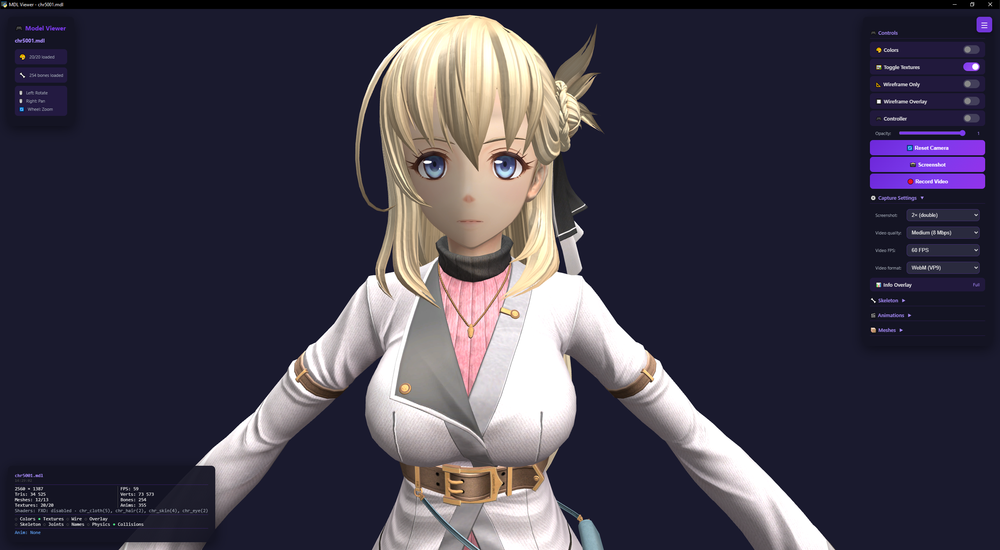

### Beta6
3D FreeCam mode

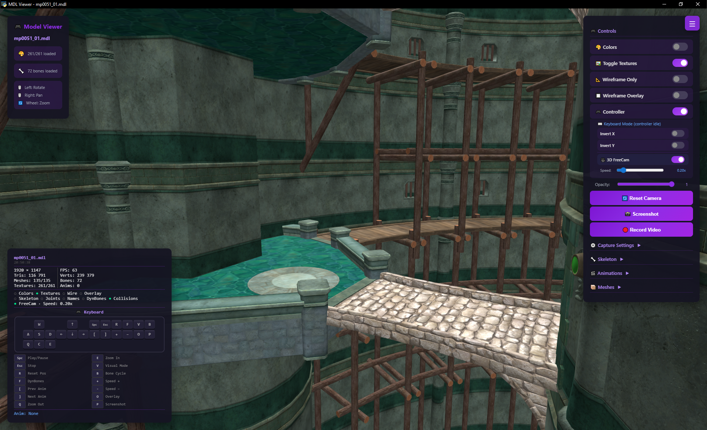

### Beta5
Added controller support
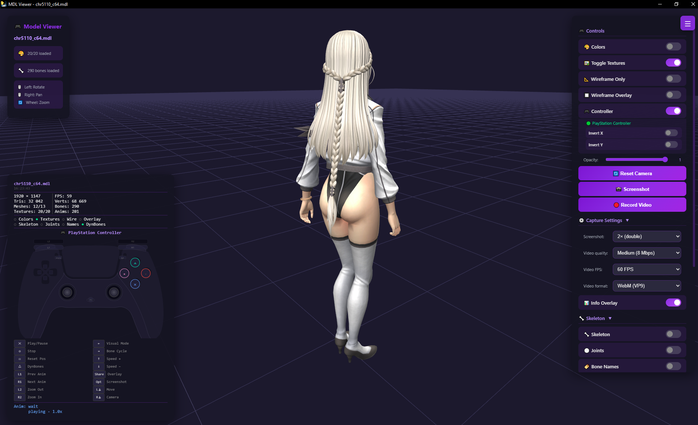
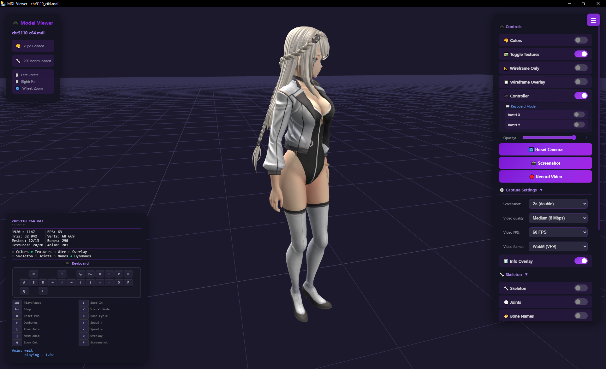

### Beta4
character movement support

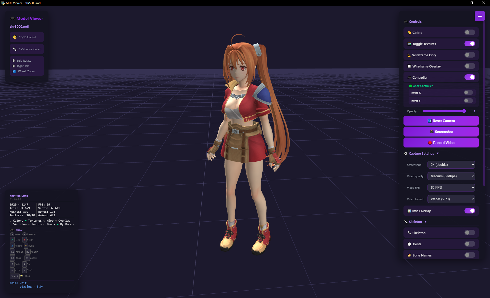

### Beta3
demo with collision on/off, physics intensity, and more


### Beta2


### Beta1


### Alpha — viewer_mdl_textured_scene.py
i may never finish it :)<br>
Scene viewer alpha
```
├───scene
└───asset
    ├───common
    │   └───model
    │   └───model_info
    └───dx11
        └───image
        └───shader
Example:
python.exe ...\asset\common\model\viewer_mdl_textured_scene.py --scene mp1010.json
```

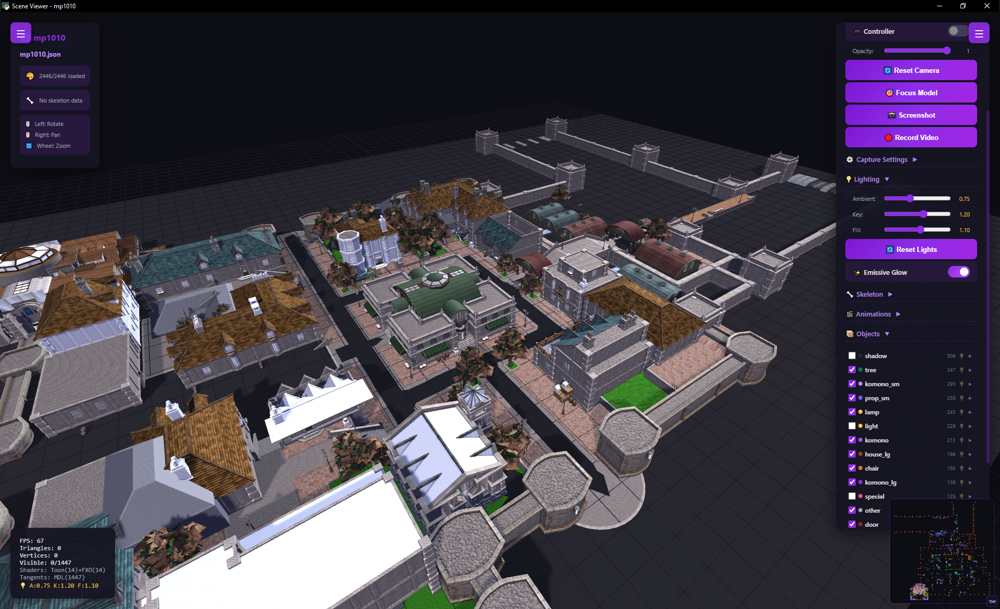
building interiors
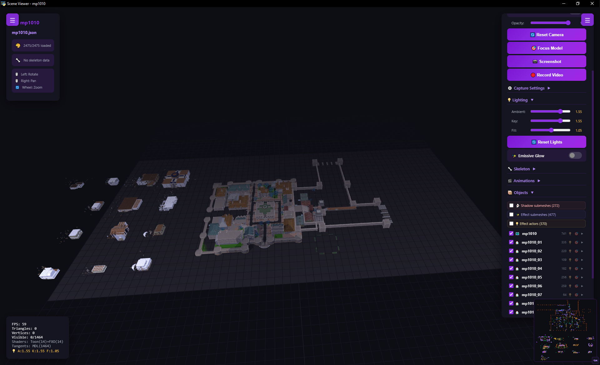
new UI for actors
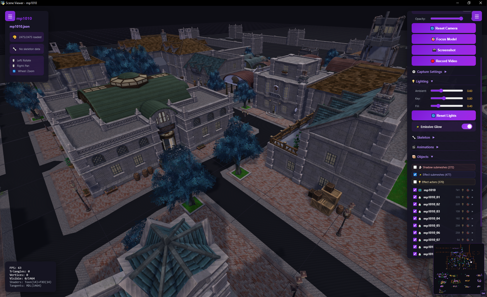

### Legacy viewers

**viewer_mdl_textured.exe** — textured model preview without animations


New UI


> **⚠️ GPL-3.0 License Notice**
> This project uses libraries from [eArmada8/kuro_dlc_tool](https://github.com/eArmada8/kuro_dlc_tool) which are licensed under GPL-3.0.
> Therefore, this entire toolkit is also distributed under GPL-3.0 license.
> See [License](#-license) section for details.

---

## 📋 Table of Contents

- [Why This Toolkit Exists](#-why-this-toolkit-exists)
- [Features](#-features)
- [Requirements](#-requirements)
- [Installation](#-installation)
- [Quick Start](#-quick-start)
- [Scripts Overview](#-scripts-overview)
- [Common Workflows](#-common-workflows)
- [File Formats](#-file-formats)
- [Troubleshooting](#-troubleshooting)
- [Best Practices](#-best-practices)
- [Version History](#-version-history)
- [External Dependencies](#-external-dependencies)
- [Contributing](#-contributing)
- [License](#-license)
- [Advanced Documentation](#-advanced-documentation) ⭐

---

## 🎯 Why This Toolkit Exists

### The Problem

When creating DLC mods for Kuro engine games, modders face multiple challenges:

**1. ID Conflicts (Primary Problem)**
- DLC mods use item IDs that may conflict with existing game items
- Manual ID conflict detection is tedious and error-prone
- A single conflicting ID can break your entire mod
- Game engine has a hard limit of 5000 IDs that cannot be expanded
- Finding safe, available ID ranges manually is time-consuming

**2. Shop Assignment Tedium (Secondary Problem)**
- Adding items to shops requires editing hundreds of entries manually
- Assigning 50 items to 10 shops = 500 manual entries
- Copy-paste errors are common
- No easy way to bulk-update shop assignments

**3. Schema Incompatibility (New Files Problem)**
- New TBL files from game updates don't have schema definitions
- KuroTools project supports new files but uses different format
- Manual schema conversion is complex and error-prone
- Missing schemas prevent reading new TBL files

**4. ID Range Planning (Visibility Problem)**
- No visual overview of which IDs are occupied vs. free
- Hard to find safe ID ranges for large mods
- Team coordination requires manual tracking
- Fragmentation analysis is impossible manually

**5. MDL-to-DLC Entry Creation (Automation Problem)** ⭐ NEW
- Adding new costume models to a DLC requires creating entries in four sections manually
- Character identification from filenames is error-prone
- Finding safe IDs across game data and existing DLCs is tedious
- A single mod can have dozens of MDL files to process

**6. Model Preview (3D Visualization Problem)**
- No quick way to preview .mdl 3D models with textures and animations
- External tools required for model inspection
- Difficult to verify model integrity, shaders, and physics
- No scene-level visualization for maps and buildings

### The Solution

This toolkit automates all six problems:

**Primary: Automatic ID Conflict Resolution**
```bash
python resolve_id_conflicts_in_kurodlc.py repair --apply
```

**Secondary: Bulk Shop Assignment**
```bash
python shops_find_unique_item_id_from_kurodlc.py my_mod.kurodlc.json --generate-template
python shops_create.py template_my_mod.json
```

**Tertiary: Schema Conversion**
```bash
python convert_kurotools_schemas.py
```

**Quaternary: ID Allocation Visualization**
```bash
python visualize_id_allocation.py
```

**Quinary: Automatic MDL Entry Generation** ⭐ NEW
```bash
# Preview what would be added (dry-run, default)
python kurodlc_add_mdl.py FalcoDLC.kurodlc.json

# Apply changes
python kurodlc_add_mdl.py FalcoDLC.kurodlc.json --apply
```
- Scans directory for .mdl files not yet in your DLC
- Auto-identifies characters from filenames using t_name data
- Finds safe IDs from game data + all existing .kurodlc.json files
- Generates complete CostumeParam, ItemTableData, DLCTableData, and ShopItem entries
- Dry-run by default, `--apply` required to write

**Senary: 3D Model Viewing with Textures, Animations & Scenes**
```bash
# Character viewer with textures + animations
python viewer_mdl/viewer_mdl_textured_anim.py character.mdl

# Scene viewer (maps, buildings)
python viewer_mdl/viewer_mdl_textured_scene.py --scene mp0010.json

# Simple viewers
python viewer_mdl/viewer_mdl.py character.mdl
python viewer_mdl/viewer_mdl_window.py character.mdl
```

---

## ✨ Features

### Primary Purpose: ID Conflict Resolution
- **⚠️ Conflict Detection**: Automatically detect ID conflicts between DLC and game data
- **🔧 Smart Resolution v2.7**: Intelligent ID assignment algorithm with 1-5000 range limit
- **🎯 Better Distribution**: IDs assigned from middle of range (2500) for optimal spacing
- **💾 Safety First**: Automatic backups and detailed logging for all modifications
- **✅ Validation**: Comprehensive .kurodlc.json structure validation

### Secondary Purpose: Bulk Shop Assignment
- **🛒 Shop Integration v2.2**: Generate shop assignments with customizable templates
- **📦 Bulk Operations**: Assign hundreds of items to multiple shops instantly
- **🎨 Custom Templates**: Define your own shop item structure
- **🤖 CI/CD Support**: Non-interactive mode for automated workflows
- **🏪 Shop-only files**: Support for .kurodlc.json files with only ShopItem section (v2.2)

### Tertiary Purpose: Schema Conversion
- **🔄 Automatic Conversion**: Convert 280+ KuroTools schemas in seconds
- **📈 Massive Expansion**: From 39 to 344+ supported TBL structures
- **🎮 Multi-Game Support**: Kuro 1, Kuro 2, Kai, Ys X, Sky 1st
- **🔍 Smart Detection**: Automatically prevents duplicates
- **📊 Detailed Reports**: Full conversion logs and statistics

### Quaternary Purpose: ID Allocation Visualization
- **📊 Interactive HTML Maps**: Color-coded visualization of ID usage
- **🖥️ Console Visualization**: Terminal-based ID allocation display
- **📈 Statistics Dashboard**: Occupancy rates, fragmentation metrics
- **🔍 Gap Analysis**: Identify free ID blocks and optimal ranges
- **🎯 Range Planning**: Find safe ID ranges for large mod projects

### Quinary Purpose: Automatic MDL Entry Generation ⭐ NEW
- **🤖 Auto-scan**: Finds .mdl files in directory not yet in your DLC
- **👤 Character Identification**: Uses t_name data for char_restrict and naming
- **🆔 Smart ID Assignment**: Searches 1-5000 range across game data + all .kurodlc.json files
- **📝 Complete Entries**: Generates CostumeParam, ItemTableData, DLCTableData, ShopItem
- **🔒 Safe Defaults**: Dry-run by default, timestamped backups with `--apply`
- **🌐 UTF-8 Support**: `--no-ascii-escape` for proper character display (e.g. Agnès)

### Senary Purpose: 3D Model Viewing
- **🎨 Textured Rendering**: Full DDS texture support with automatic path resolution
- **🦴 Skeleton & Animations**: T-Pose, Idle, Wave, Walk, facial animations
- **⚛️ Physics Simulation**: Character physics with collision and intensity controls
- **🎮 Controller Support**: DualSense, DualShock, Switch Pro, Generic, Keyboard (WSAD)
- **🎬 Scene Mode**: Parse binary scene JSON and render 3D map layouts with FPS camera
- **🔍 FXO Shader Support**: Game shader files with fallback to generated shaders
- **📹 Video Recording**: Including quality settings for video and screenshots
- **🌅 Skybox & Lighting**: Background colors, lighting settings, emissive fix
- **🗺️ FreeCam Mode**: 3D free camera for landscapes and buildings
- **🎯 Mesh Focus & Highlighting**: Focus on individual meshes, auto-hide shadow/kage meshes

### Additional Tools
- **🔍 Item Discovery**: Search and browse game items from JSON, TBL, and P3A sources
- **👤 Name Browser**: Search character names from game database
- **📋 Multiple Formats**: Support for JSON, TBL, and P3A archive formats
- **🎨 User-Friendly**: Interactive menus and colored output (Windows CMD compatible)

---

## 📦 Requirements

### Python Version
- Python 3.7 or higher (Python 3.11 recommended for viewer_mdl with pywebview)

### Required Python Libraries
Install via `install_python_modules.bat` (Windows) or manually:
```bash
pip install colorama --break-system-packages
```

### External Libraries (Included in Repository)

This toolkit uses libraries from [eArmada8/kuro_dlc_tool](https://github.com/eArmada8/kuro_dlc_tool):

- **`p3a_lib.py`** — P3A archive handling (GPL-3.0)
- **`kurodlc_lib.py`** — Kuro table (.tbl) file handling (GPL-3.0)

**⚠️ GPL-3.0 License Implications:**

- ✅ **This entire toolkit is licensed under GPL-3.0**
- ✅ **You can freely use, modify, and distribute this toolkit**
- ⚠️ **Any modifications must also be GPL-3.0**
- ⚠️ **Source code must be made available to users**
- ⚠️ **You cannot incorporate this into proprietary software**

See the [License](#-license) section for full details.

### Optional Dependencies

**For P3A/TBL Support:**
```bash
pip install lz4 zstandard xxhash --break-system-packages
```

**For 3D Model Viewing (viewer_mdl):**
```bash
pip install numpy blowfish zstandard xxhash --break-system-packages

# For textured viewer (viewer_mdl_textured*.py):
pip install pywebview Pillow --break-system-packages

# For video recording:
pip install av --break-system-packages
```

**All viewer_mdl dependencies at once:**
```bash
pip install colorama zstandard lz4 xxhash blowfish av pywebview Pillow --break-system-packages
```

**Note:** If you only work with JSON files (`.kurodlc.json`, `t_item.json`, etc.), the optional dependencies are not needed. All core functionality works with JSON only.

---

## 🚀 Installation

### Option 1: Download Release (Recommended)
1. Download the latest release from [Releases](https://github.com/falco81/KuroDLCTools/releases)
2. Extract to your desired location
3. Run `install_python_modules.bat` (Windows) or install packages manually

### Option 2: Clone Repository
```bash
git clone https://github.com/falco81/KuroDLCTools.git
cd KuroDLCTools
```

### Install Dependencies

**Windows (root toolkit):**
```bash
install_python_modules.bat
```

**Windows (viewer_mdl — includes Pillow, pywebview, av):**
```bash
cd viewer_mdl
install_python_modules.bat
```

**Linux/Mac:**
```bash
pip install colorama --break-system-packages

# Optional: for P3A/TBL support
pip install lz4 zstandard xxhash --break-system-packages

# Optional: for 3D model viewing
pip install numpy blowfish zstandard pywebview Pillow av --break-system-packages
```

### Setup for Schema Conversion

To use the schema converter, you need KuroTools schemas:

1. Download KuroTools from https://github.com/nnguyen259/KuroTools
2. Extract the `schemas/` folder
3. Place it in the same directory as `convert_kurotools_schemas.py`

**File Structure:**
```
KuroDLCTools/
├── convert_kurotools_schemas.py
├── kurodlc_schema.json
└── schemas/
    └── headers/
        ├── ATBonusParam.json
        ├── ItemTableData.json
        └── ... (280+ files)
```

---

## 🚀 Quick Start

### 1. Fix ID Conflicts in Your DLC (Primary Use Case)
```bash
# Detect conflicts
python resolve_id_conflicts_in_kurodlc.py checkbydlc

# Repair with smart algorithm (automatic)
python resolve_id_conflicts_in_kurodlc.py repair --apply

# Export mapping for manual editing
python resolve_id_conflicts_in_kurodlc.py repair --export --export-name=my_mod

# Import edited mapping
python resolve_id_conflicts_in_kurodlc.py repair --import --mapping-file=id_mapping_my_mod.json
```

### 2. Generate Shop Assignments (Secondary Use Case)
```bash
# Generate template from your DLC
python shops_find_unique_item_id_from_kurodlc.py my_mod.kurodlc.json --generate-template

# Customize template_my_mod.json if needed

# Generate shop assignments
python shops_create.py template_my_mod.json
```

### 3. Add MDL Models to DLC Automatically ⭐ NEW
```bash
# Preview what would be added (dry-run, default)
python kurodlc_add_mdl.py FalcoDLC.kurodlc.json

# Apply changes with backup
python kurodlc_add_mdl.py FalcoDLC.kurodlc.json --apply

# With custom shop IDs and ID range
python kurodlc_add_mdl.py FalcoDLC.kurodlc.json --shop-ids=21,22 --min-id=3000 --max-id=4000 --apply
```

### 4. Visualize ID Allocation
```bash
# Generate both console and HTML visualization
python visualize_id_allocation.py

# Console only
python visualize_id_allocation.py --format=console

# HTML only with custom name
python visualize_id_allocation.py --format=html --output=my_report.html
```

### 5. View 3D Models
```bash
# Full viewer with textures + animations + physics (recommended)
python viewer_mdl/viewer_mdl_textured_anim.py character.mdl

# Scene mode (maps, buildings)
python viewer_mdl/viewer_mdl_textured_scene.py --scene mp0010.json

# Textured viewer without animations
python viewer_mdl/viewer_mdl_textured.py character.mdl

# Simple HTML output
python viewer_mdl/viewer_mdl.py character.mdl

# Native window (no files created)
python viewer_mdl/viewer_mdl_window.py character.mdl

# Disable toon shaders
python viewer_mdl/viewer_mdl_textured_anim.py character.mdl --no-shaders
```

### 6. Convert KuroTools Schemas
```bash
python convert_kurotools_schemas.py
# Output: kurodlc_schema_updated.json and conversion_report.txt
```

### 7. Browse Game Items
```bash
python find_all_items.py
python find_all_names.py
python find_all_shops.py
python find_unique_item_id_for_t_costumes.py
python find_unique_item_id_for_t_item_category.py
```

---

## 📚 Scripts Overview

### Core Scripts

#### 1. `resolve_id_conflicts_in_kurodlc.py` (v2.7.1)
**Purpose:** Detect and resolve ID conflicts between DLC mods and game data

**Features:**
- Smart ID assignment algorithm (v2.7)
- Searches only in range 1-5000
- Starts from middle (2500) for better distribution
- Automatic backups and detailed logging
- Export/import workflow for manual control

**Usage:**
```bash
python resolve_id_conflicts_in_kurodlc.py checkbydlc
python resolve_id_conflicts_in_kurodlc.py repair --apply
python resolve_id_conflicts_in_kurodlc.py repair --export --export-name=my_mod
python resolve_id_conflicts_in_kurodlc.py repair --import --mapping-file=id_mapping_my_mod.json
```

#### 2. `shops_find_unique_item_id_from_kurodlc.py` (v2.2)
**Purpose:** Extract item IDs from DLC and generate shop assignment templates

**Features:**
- Automatic ID extraction from multiple sections
- Template generation for shops_create.py
- Auto-detect or manual shop ID specification
- CI/CD support with `--no-interactive` flag
- **NEW in v2.2:** Support for shop-only .kurodlc.json files (e.g. Daybreak2CostumeShop)

**Usage:**
```bash
python shops_find_unique_item_id_from_kurodlc.py my_mod.kurodlc.json
python shops_find_unique_item_id_from_kurodlc.py my_mod.kurodlc.json --generate-template
python shops_find_unique_item_id_from_kurodlc.py my_mod.kurodlc.json --generate-template --shop-ids=5,6,10
```

#### 3. `shops_create.py` (v2.0)
**Purpose:** Generate shop assignments from template configuration

**Features:**
- Variable substitution (`${shop_id}`, `${item_id}`, `${index}`, `${count}`)
- Custom output sections
- Custom template support
- Backward compatible with v1.0

**Usage:**
```bash
python shops_create.py template_my_mod.json
python shops_create.py config.json output.json
```

#### 4. `kurodlc_add_mdl.py` (v2.1) ⭐ NEW
**Purpose:** Scan for .mdl files and automatically create complete DLC entries

**Features:**
- Scans directory for .mdl files not present in the target .kurodlc.json
- Uses t_name data for character identification (char_restrict and character names)
- Smart ID assignment: collects used IDs from t_item + all .kurodlc.json files
- Tries continuous ID block first, falls back to scattered search
- Generates CostumeParam, ItemTableData, DLCTableData, ShopItem entries
- Dry-run by default (preview only), `--apply` required to write
- Timestamped backups (`_YYYYMMDD_HHMMSS.bak`)
- UTF-8 support with `--no-ascii-escape`

**Usage:**
```bash
# Preview (dry-run, default)
python kurodlc_add_mdl.py FalcoDLC.kurodlc.json

# Apply changes
python kurodlc_add_mdl.py FalcoDLC.kurodlc.json --apply

# Custom options
python kurodlc_add_mdl.py FalcoDLC.kurodlc.json --shop-ids=21,22 --apply
python kurodlc_add_mdl.py FalcoDLC.kurodlc.json --min-id=3000 --max-id=4000 --apply
python kurodlc_add_mdl.py FalcoDLC.kurodlc.json --no-interactive --no-ascii-escape --apply
```

**Options:**
```
--apply             Apply changes (without this, runs in dry-run mode)
--dry-run           Explicit dry-run (default behavior, no changes written)
--shop-ids=1,2,3    Override shop IDs (default: auto-detect from file)
--min-id=N          Minimum ID for search range (default: 1)
--max-id=N          Maximum ID for search range (default: 5000)
--no-interactive    Auto-select sources without prompting
--no-backup         Skip backup creation when applying
--no-ascii-escape   Write UTF-8 directly (e.g. Agnès instead of Agn\u00e8s)
```

**Requirements (in the same directory):**
- `.mdl` files to add
- t_name source (`t_name.json`, `t_name.tbl`, or P3A archive)
- t_item source (`t_item.json`, `t_item.tbl`, or P3A archive)

#### 5. `visualize_id_allocation.py`
**Purpose:** Visualize ID allocation patterns and statistics

**Features:**
- Interactive HTML report with color-coded ID map
- Console visualization with statistics
- Gap analysis and free block identification
- Fragmentation metrics
- Customizable block sizes
- Multiple source support (JSON, TBL, P3A)

**Usage:**
```bash
python visualize_id_allocation.py
python visualize_id_allocation.py --format=html --output=my_report.html
python visualize_id_allocation.py --format=console --block-size=100
python visualize_id_allocation.py --source=json --no-interactive
```

#### 6. `convert_kurotools_schemas.py`
**Purpose:** Convert KuroTools schema definitions to kurodlc_schema.json format

**Features:**
- Converts 280+ KuroTools schemas
- Automatic type mapping
- Nested structure flattening
- Duplicate detection and merging
- Detailed conversion reports

**Usage:**
```bash
python convert_kurotools_schemas.py
```

**Requirements:** KuroTools `schemas/` folder in same directory

**Output:** `kurodlc_schema_updated.json` and `conversion_report.txt`

### Discovery Scripts

#### 7. `find_all_items.py`
Browse all items from game database (supports JSON, TBL, P3A sources)

```bash
python find_all_items.py
python find_all_items.py --source=json
```

#### 8. `find_all_names.py`
Browse character names from game database (supports JSON, TBL, P3A sources)

```bash
python find_all_names.py
```

#### 9. `find_all_shops.py`
Browse all shops from game database (supports JSON, TBL, P3A sources)

```bash
python find_all_shops.py
```

#### 10. `find_unique_item_id_for_t_costumes.py`
Find unique/available IDs for costume category

```bash
python find_unique_item_id_for_t_costumes.py
```

#### 11. `find_unique_item_id_for_t_item_category.py`
Find unique/available IDs by item category

```bash
python find_unique_item_id_for_t_item_category.py
```

#### 12. `find_unique_item_id_from_kurodlc.py`
Extract unique item IDs from DLC files

```bash
python find_unique_item_id_from_kurodlc.py my_mod.kurodlc.json
```

### 3D Model Viewer Scripts (viewer_mdl/)

#### 13. `viewer_mdl_textured_anim.py` ⭐ MAIN VIEWER
**Purpose:** Full-featured 3D model viewer with textures, skeleton, animations, physics, controller support, FXO shaders, facial animations, skybox, and video recording.

**Usage:**
```bash
python viewer_mdl/viewer_mdl_textured_anim.py character.mdl
python viewer_mdl/viewer_mdl_textured_anim.py character.mdl --recompute-normals
python viewer_mdl/viewer_mdl_textured_anim.py character.mdl --no-shaders
python viewer_mdl/viewer_mdl_textured_anim.py character.mdl --debug --skip-popup
```

**Options:**
```
--recompute-normals  Recompute smooth normals instead of using originals from MDL
--debug              Enable verbose console logging in browser
--skip-popup         Skip loading progress popup on startup
--no-shaders         Disable toon shader rendering, use standard PBR materials
```

**Key Features:**
- DDS texture loading with automatic path resolution
- Skeleton hierarchy visualization
- Animations: T-Pose, Idle, Wave, Walk, facial animations
- Physics simulation with collision and intensity controls
- Controller support: DualSense, DualShock, Switch Pro, Generic, Keyboard (WSAD)
- FXO game shader support with fallback
- Video recording with quality settings
- Skybox support, lighting and background color customization
- Mesh highlighting, auto-hide shadow/kage meshes
- Configurable via `viewer_mdl_textured_config.md`

#### 14. `viewer_mdl_textured_scene.py` — Scene Viewer
**Purpose:** Extended viewer with scene mode for rendering 3D map layouts, building interiors, and terrain

**Usage:**
```bash
# Single model (same as viewer_mdl_textured_anim.py)
python viewer_mdl/viewer_mdl_textured_scene.py character.mdl

# Scene mode — load binary scene JSON
python viewer_mdl/viewer_mdl_textured_scene.py --scene mp0010.json
```

**Scene Mode Features:**
- Parses binary scene JSON files from `scene/` directory
- Loads actual MDL models from `asset/`
- Full viewer UI: textures, shaders, gamepad, screenshots
- FreeCam, minimap, search, category filters
- Fog, grid, wireframe, and all MDL viewer features

**Expected directory structure:**
```
├───scene/          (scene JSON files)
└───asset/
    ├───common/
    │   ├───model/
    │   └───model_info/
    └───dx11/
        ├───image/
        └───shader/
```

#### 15. `viewer_mdl_textured.py` — Textured Viewer (no animations)
**Purpose:** Simplified textured model preview without skeleton or animations

```bash
python viewer_mdl/viewer_mdl_textured.py character.mdl
```

#### 16. `viewer_mdl.py` — HTML Viewer
**Purpose:** Generate HTML visualization of .mdl files with Three.js

```bash
python viewer_mdl/viewer_mdl.py character.mdl
python viewer_mdl/viewer_mdl.py character.mdl --use-original-normals
```

**Output:** `<model_name>_viewer.html`

#### 17. `viewer_mdl_window.py` — Native Window Viewer
**Purpose:** Preview models in native window without creating files

```bash
python viewer_mdl/viewer_mdl_window.py character.mdl
```

**Requires:** `pip install pywebview`

**Platform Support:** Windows (Edge WebView2), Linux (GTK + WebKit2), macOS (WKWebView)

#### 18. `viewer_mdl_optimized.py` — Optimized Viewer
**Purpose:** Performance-optimized version using base64 compression for large models

```bash
python viewer_mdl/viewer_mdl_optimized.py character.mdl
```

#### 19. `viewer.py` — Standalone Core Viewer
**Purpose:** Minimal standalone viewer with integrated loading functions

```bash
python viewer_mdl/viewer.py character.mdl
```

### Support Libraries (viewer_mdl/)

| File | Description | Source |
|------|-------------|--------|
| `kuro_mdl_export_meshes.py` | MDL model parsing and mesh export | [eArmada8/kuro_mdl_tool](https://github.com/eArmada8/kuro_mdl_tool) |
| `lib_fmtibvb.py` | Format/Index/Vertex buffer handling | [eArmada8/kuro_mdl_tool](https://github.com/eArmada8/kuro_mdl_tool) |
| `lib_texture_loader.py` | DDS texture loading and conversion | KuroDLCTools |
| `three.min.js` | Three.js 3D rendering library | [three.js](https://threejs.org/) |
| `viewer_mdl_textured_config.md` | Viewer configuration documentation | KuroDLCTools |

---

## 🔄 Common Workflows

### Workflow 1: Complete Mod Creation
```bash
# Step 1: Visualize available ID ranges
python visualize_id_allocation.py

# Step 2: Add MDL models to DLC automatically
python kurodlc_add_mdl.py my_mod.kurodlc.json --apply

# Step 3: Check for conflicts
python resolve_id_conflicts_in_kurodlc.py checkbydlc

# Step 4: Fix conflicts automatically
python resolve_id_conflicts_in_kurodlc.py repair --apply

# Step 5: Generate shop assignments
python shops_find_unique_item_id_from_kurodlc.py my_mod.kurodlc.json --generate-template
python shops_create.py template_my_mod.json
```

### Workflow 2: Batch MDL Addition
```bash
# Place all .mdl files in the working directory alongside game data

# Preview what would be added
python kurodlc_add_mdl.py FalcoDLC.kurodlc.json

# Apply with custom ID range and shop IDs
python kurodlc_add_mdl.py FalcoDLC.kurodlc.json --shop-ids=21,22 --min-id=3000 --max-id=4000 --apply

# Verify results
python find_unique_item_id_from_kurodlc.py FalcoDLC.kurodlc.json
```

### Workflow 3: Manual ID Control
```bash
# Export repair plan
python resolve_id_conflicts_in_kurodlc.py repair --export --export-name=my_mod

# Manually edit id_mapping_my_mod.json

# Import and apply
python resolve_id_conflicts_in_kurodlc.py repair --import --mapping-file=id_mapping_my_mod.json
```

### Workflow 4: Team Coordination
```bash
# Team lead: Generate ID allocation report
python visualize_id_allocation.py --format=html --output=team_report.html

# Share team_report.html with team
# Each modder uses assigned ID ranges from report
```

### Workflow 5: Schema Update
```bash
# Download KuroTools schemas folder
# Convert schemas
python convert_kurotools_schemas.py

# Replace kurodlc_schema.json with kurodlc_schema_updated.json
# Test with new TBL files
python find_all_items.py --source=tbl
```

### Workflow 6: 3D Model Inspection
```bash
# Full-featured viewer (recommended)
python viewer_mdl/viewer_mdl_textured_anim.py character.mdl

# Without toon shaders
python viewer_mdl/viewer_mdl_textured_anim.py character.mdl --no-shaders

# Scene viewer for maps
python viewer_mdl/viewer_mdl_textured_scene.py --scene mp1010.json

# Quick preview without animations
python viewer_mdl/viewer_mdl_textured.py character.mdl

# Generate shareable HTML
python viewer_mdl/viewer_mdl.py character.mdl
```

---

## 📄 File Formats

### .kurodlc.json Format
Main DLC mod configuration file. Contains:
- **CostumeParam**: Costume definitions with item_id references
- **ItemTableData**: Item metadata (names, descriptions, categories)
- **DLCTableData**: DLC pack definitions with item lists
- **ShopItem**: Shop assignment entries (optional, can be standalone in v2.2)

### ID Mapping Format
```json
{
  "source_file": "my_mod.kurodlc.json",
  "timestamp": "2026-02-04 12:00:00",
  "game_database": "t_item.json",
  "game_id_count": 2116,
  "game_id_range": [1, 4921],
  "mappings": {
    "310": 2500,
    "311": 2501
  },
  "conflicts": [
    {
      "old_id": 310,
      "new_id": 2500,
      "reason": "Conflict with game item: Earth Sepith"
    }
  ]
}
```

### Shop Template Format
```json
{
  "_comment": ["Template for shops_create.py"],
  "item_ids": [3596, 3597, 3598],
  "shop_ids": [5, 6, 10],
  "template": {
    "shop_id": "${shop_id}",
    "item_id": "${item_id}",
    "unknown": 1,
    "start_scena_flags": [],
    "empty1": 0,
    "end_scena_flags": [],
    "int2": 0
  }
}
```

### Visualization Report
- **HTML format**: Interactive color-coded ID allocation map
- **Console format**: Terminal-based visualization with statistics

### 3D Model Formats
- **Input**: `.mdl` files (Kuro engine 3D models)
- **Input**: `.json` scene files (binary scene format, for `--scene` mode)
- **Output**: HTML with Three.js or native window display

---

## 🔧 Troubleshooting

### Common Issues

**1. "No module named 'colorama'"**
```bash
pip install colorama --break-system-packages
```

**2. "Cannot read .tbl files"**
```bash
pip install lz4 zstandard xxhash --break-system-packages
```

**3. "No schemas found" (convert_kurotools_schemas.py)**
Download KuroTools and place `schemas/` folder in toolkit directory.

**4. "No free IDs available"**
Game has reached 5000 ID limit. Use `visualize_id_allocation.py` to find gaps.

**5. "viewer_mdl_textured_anim.py not working"**
Install all viewer dependencies:
```bash
pip install pywebview Pillow numpy blowfish zstandard xxhash --break-system-packages
```

**6. Textures not loading in viewer**
Ensure the standard folder structure exists relative to the model file:
```
└───asset
    ├───common
    │   └───model
    │   └───model_info
    └───dx11
        └───image
        └───shader
```

**7. "kurodlc_add_mdl.py: No t_name source found"**
Place `t_name.json`, `t_name.tbl`, or a P3A archive in the working directory.

**8. Visualization shows no data**
Ensure data source (`t_item.json` or `.tbl`) is in current directory.

**9. pywebview issues on Python 3.12+**
Python 3.11 is recommended for pywebview compatibility. See `viewer_mdl/build.txt` for details.

### Platform-Specific Notes

**Windows:**
- Use `install_python_modules.bat` for easy setup
- Colored output works in CMD and PowerShell
- WebView2 required for viewer windows (usually pre-installed on Win 10+)

**Linux:**
- Use `--break-system-packages` flag with pip
- Install GTK and WebKit2 for viewer windows
- Some distributions may need `python3` instead of `python`

**macOS:**
- Use `--break-system-packages` flag with pip
- WKWebView used for viewer windows

---

## 💡 Best Practices

### ID Management
1. **Always visualize first**: Run `visualize_id_allocation.py` before creating mods
2. **Use safe ranges**: Choose IDs from large free blocks (>50 IDs)
3. **Start from middle**: The smart algorithm uses 2500+ for better distribution
4. **Leave buffer**: Don't use all IDs in a range, leave space for future additions
5. **Document ranges**: Keep notes on which ID ranges your mods use

### MDL Entry Generation
1. **Preview first**: Always run `kurodlc_add_mdl.py` without `--apply` first
2. **Have game data ready**: Ensure t_name and t_item sources are in the directory
3. **Check ID ranges**: Use `--min-id` and `--max-id` to control where IDs are assigned
4. **Use UTF-8**: Add `--no-ascii-escape` for proper character display in the JSON

### Shop Assignment
1. **Generate templates**: Use `shops_find_unique_item_id_from_kurodlc.py --generate-template`
2. **Review before applying**: Check generated template before running shops_create.py
3. **Use meaningful shop IDs**: Match actual game shop IDs from t_shop.json
4. **Shop-only files**: v2.2 supports .kurodlc.json files with only ShopItem section

### 3D Model Viewing
1. **Use the full viewer**: `viewer_mdl_textured_anim.py` is the most complete viewer
2. **Scene mode for maps**: Use `--scene` flag for map/building exploration
3. **Disable shaders if needed**: Use `--no-shaders` for standard PBR rendering
4. **See config**: Check `viewer_mdl/viewer_mdl_textured_config.md` for customization

### General
1. **Keep backups**: Scripts create automatic backups, but keep your own too
2. **Read logs**: Check log files for detailed information on operations
3. **Test incrementally**: Test changes on small DLCs before large projects
4. **Version control**: Use git or similar to track changes to your mods

---

## 📜 Version History

### v3.1 (2026-02-14) - LATEST ⭐
**New Features:**
- **`kurodlc_add_mdl.py` v2.1**: Automatic MDL-to-DLC entry generation
  - Scans directory for .mdl files not in DLC
  - Smart ID assignment across game data + all .kurodlc.json files
  - Character identification from filenames using t_name
  - Generates complete CostumeParam, ItemTableData, DLCTableData, ShopItem
  - Dry-run by default, `--apply` required to write
  - Timestamped backups

- **`viewer_mdl_textured_anim.py` Ver 1.0**: Full-featured 3D model viewer
  - Skybox support, lighting and background customization
  - Facial animations
  - FXO game shader support with fallback
  - Physics simulation with collision
  - Controller support (DualSense, DualShock, Switch Pro, Generic, Keyboard)
  - 3D FreeCam mode
  - Video recording with quality settings
  - Mesh highlighting and focus

- **`viewer_mdl_textured_scene.py`**: Scene viewer
  - Binary scene JSON parsing
  - Renders 3D map layouts with FPS camera
  - Full viewer UI: textures, shaders, gamepad, minimap, search

- **`viewer_mdl_textured.py`**: Textured model viewer (no animations)
- **`lib_texture_loader.py`**: DDS texture loading utility

**Improvements:**
- `shops_find_unique_item_id_from_kurodlc.py` v2.2: Shop-only file support
- Updated install scripts with Pillow, av, pywebview
- Viewer configuration documentation (`viewer_mdl_textured_config.md`)

### v3.0 (2026-02-04)
**New Features:**
- **visualize_id_allocation.py**: Complete ID allocation visualization system
- **3D Model Viewer Suite** (viewer_mdl/):
  - `viewer.py`, `viewer_mdl.py`, `viewer_mdl_optimized.py`, `viewer_mdl_window.py`
  - Automatic smooth normal computation
  - Three.js integration

### v2.8 (2026-01-31) - Schema Conversion
- **convert_kurotools_schemas.py**: Complete KuroTools schema converter
  - Converts 280+ schema definitions, expands support from 39 to 344+

### v2.7.1 (2026-01-31) - resolve_id_conflicts BUGFIX
- Fixed bare except clause, improved error handling

### v2.7.0 (2026-01-31) - resolve_id_conflicts SMART ALGORITHM
- Smart ID distribution, middle-out assignment from 2500, enforced 1-5000 range

### v2.1 (2026-01-31) - shops_find BUGFIX & CI/CD
- `--no-interactive` flag, `--default-shop-ids`, better error handling

### v2.0 (2026-01-31) - shops_create ENHANCED & shops_find TEMPLATE
- Variable substitution, custom templates, auto-extract IDs from DLC

### v1.0 (2025) - Initial Release
- Basic ID extraction, shop assignment, item discovery, conflict detection

---

## 🔗 External Dependencies

### From [eArmada8/kuro_dlc_tool](https://github.com/eArmada8/kuro_dlc_tool)
- **`p3a_lib.py`** — P3A archive handling
- **`kurodlc_lib.py`** — Kuro table (.tbl) file handling

**License:** GPL-3.0 | **Author:** eArmada8

### From [eArmada8/kuro_mdl_tool](https://github.com/eArmada8/kuro_mdl_tool)
- **`kuro_mdl_export_meshes.py`** — MDL model parsing and mesh export
- **`lib_fmtibvb.py`** — Format/Index/Vertex buffer handling

**License:** GPL-3.0 | **Author:** eArmada8

**Note:** These libraries are included in the repository. All credit goes to the original authors.

### From [nnguyen259/KuroTools](https://github.com/nnguyen259/KuroTools)
- **Schema definitions** — 280+ TBL structure definitions in `schemas/headers/`

**Note:** KuroTools schemas are NOT included in this repository. Users must download them separately.

### Python Packages

| Package | License | Used for |
|---------|---------|----------|
| `colorama` | BSD | Colored terminal output (Windows CMD compatible) |
| `numpy` | BSD | 3D model vertex processing |
| `pywebview` | BSD | Native window viewer |
| `Pillow` | HPND | DDS texture conversion |
| `av` | LGPL | Video recording in viewer |
| `blowfish` | MIT | CLE encrypted asset decryption |
| `lz4` | BSD | LZ4 compression (P3A/TBL) |
| `zstandard` | BSD | Zstandard compression (P3A/TBL) |
| `xxhash` | BSD | xxHash hashing (P3A/TBL) |

---

## 🤝 Contributing

Contributions are welcome! Since this project is GPL-3.0, all contributions must also be GPL-3.0 compatible.

### How to Contribute

1. **Fork the repository**
2. **Create a feature branch**: `git checkout -b feature/your-feature`
3. **Make your changes** — follow existing code style, add comments, update docs
4. **Test your changes** — test with real DLC files, verify backward compatibility
5. **Submit a pull request** — describe changes clearly, reference related issues

### Code Style
- Python 3.7+ compatible syntax
- PEP 8 guidelines
- Meaningful variable names
- Docstrings on functions
- `with open()` for file operations
- Avoid bare `except:` clauses

---

## 📜 License

### GPL-3.0 License

This project is licensed under the **GNU General Public License v3.0**.

**Why GPL-3.0?** This toolkit uses libraries from [eArmada8/kuro_dlc_tool](https://github.com/eArmada8/kuro_dlc_tool) and [eArmada8/kuro_mdl_tool](https://github.com/eArmada8/kuro_mdl_tool), both GPL-3.0 licensed.

✅ **You CAN:** Use, modify, distribute freely
⚠️ **You MUST:** Keep GPL-3.0 license, make source available, license modifications under GPL-3.0
❌ **You CANNOT:** Incorporate into proprietary/closed-source software

See the [LICENSE](LICENSE) file for the complete text.

**More info:** [gnu.org/licenses/gpl-3.0](https://www.gnu.org/licenses/gpl-3.0.html) | [choosealicense.com/gpl-3.0](https://choosealicense.com/licenses/gpl-3.0/)

---

## 🙏 Acknowledgments

- **eArmada8** — For [kuro_dlc_tool](https://github.com/eArmada8/kuro_dlc_tool) and [kuro_mdl_tool](https://github.com/eArmada8/kuro_mdl_tool) libraries
- **nnguyen259** — For [KuroTools](https://github.com/nnguyen259/KuroTools) schema definitions
- **The Kuro modding community** — For testing and feedback
- **All contributors** — Thank you for your contributions!

---

## 📚 Advanced Documentation

For comprehensive, in-depth documentation see:

**[ADVANCED_DOCUMENTATION.md](doc/ADVANCED_DOCUMENTATION.md)** — Complete parameter reference, real data examples, data structure specs, advanced workflows

**[NEW_FEATURES_DOCUMENTATION.md](doc/NEW_FEATURES_DOCUMENTATION.md)** — Visualization guide, 3D model viewer guide

**[viewer_mdl_textured_config.md](viewer_mdl/viewer_mdl_textured_config.md)** — Viewer configuration (camera zoom, shadow hiding, background colors)

**Quick links:**
- [Script Parameter Reference](doc/ADVANCED_DOCUMENTATION.md#script-reference)
- [Data Structure Specs](doc/ADVANCED_DOCUMENTATION.md#data-structure-specifications)
- [Real Data Examples](doc/ADVANCED_DOCUMENTATION.md#real-data-examples)
- [Advanced Workflows](doc/ADVANCED_DOCUMENTATION.md#advanced-workflows)
- [Schema Conversion Guide](doc/ADVANCED_DOCUMENTATION.md#schema-conversion)
- [Visualization Guide](doc/NEW_FEATURES_DOCUMENTATION.md)
- [3D Viewer Guide](doc/ADVANCED_DOCUMENTATION.md#3d-model-viewing)

---

## 📧 Support

- **Issues:** [GitHub Issues](https://github.com/falco81/KuroDLCTools/issues)
- **Discussions:** [GitHub Discussions](https://github.com/falco81/KuroDLCTools/discussions)

---

<p align="center">
  <strong>Happy Modding! 🎮</strong>
</p>

<p align="center">
  Made with ❤️ for the Kuro modding community
</p>
